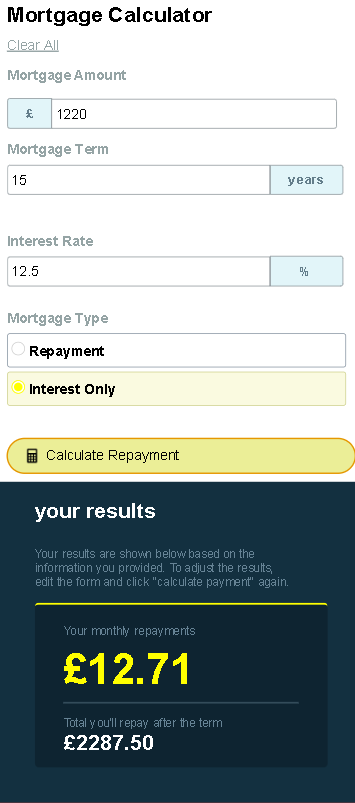
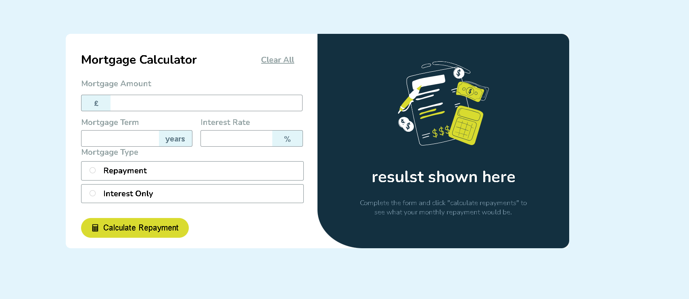
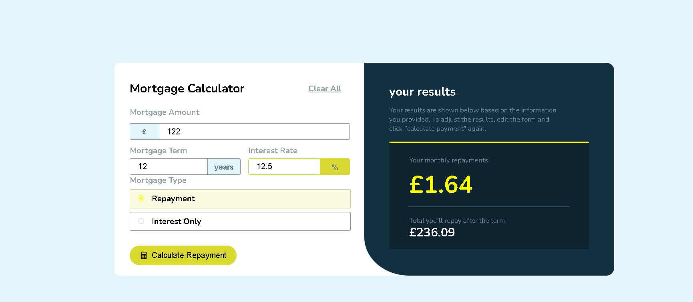

# Mortgage Calculator Documentation

## Overview
A mortgage calculator application that allows users to calculate their mortgage payments with an intuitive interface and responsive design.

---

## The Challenge

Users should be able to:
- Calculate monthly and total repayment amounts by inputting mortgage details.
- See validation messages when fields are incomplete.
- Navigate and complete the form using keyboard only.
- Experience a responsive layout that adapts to different screen sizes.
- See visual feedback through hover and focus states on interactive elements.

---

## Screenshot

  
  

---

## Links

- **Solution URL**: (https://github.com/12ff12/mortgage-calculator)

---

## My Process

- Created a static design first.
- Implemented interactive effects and functionality.

---

## Built With

- React.js  
- CSS custom properties  
- Flexbox  
- Mobile-first workflow  

---

## What I Learned

- React state management is powerful for handling UI interactions.
- CSS transitions create professional-looking effects.
- Form validation improves user experience.
- Responsive design principles are crucial for mobile users _(not my best performance)_.
- Event handling in React makes interactive elements easy to implement.

---

## Continued Development

- Planning to implement Redux.
- Learning Laravel for backend development.
- Improving mobile responsiveness.
- Adding more calculation features.

---

## Useful Resources

- **Cursor (VS Code version)**: Helped with code completion and learning.  
- **React Documentation**: For component management.  
- **MDN Web Docs**: For JavaScript and CSS references.

---

## Author

**Abderrahime Hassay**

---

## Acknowledgments

- VS Code and Cursor AI for development assistance.  
- Frontend Mentor community.  
- React documentation and community resources.

